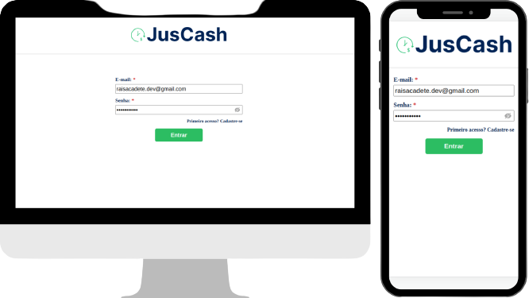
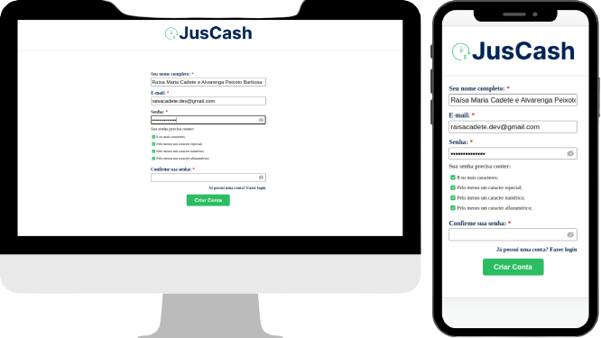
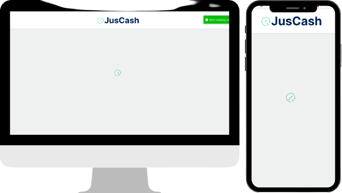
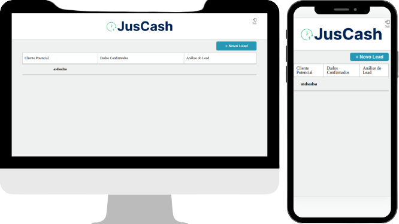
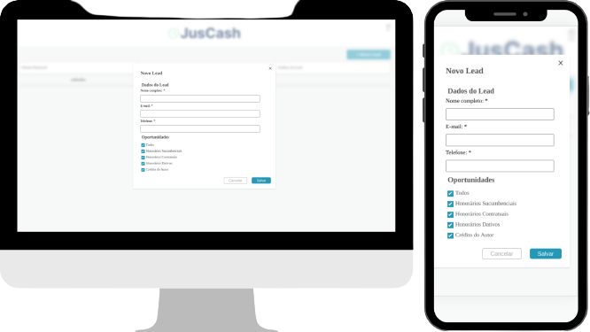
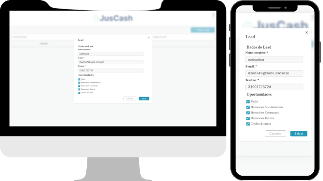

# JusCash - Aplicação de Gestão de Leads
 

## Índice

- [Introdução](#introdução)
- [Capturas de Tela](#capturas-de-tela)
- [Descrição da Aplicação](#descrição-da-aplicação)
- [Tecnologias e Bibliotecas Utilizadas](#tecnologias-e-bibliotecas-utilizadas)
- [Como Executar](#como-executar)
- [Verificando a Porta](#verificando-a-porta)
## Introdução <a name="introdução"></a>

Este é um projeto front-end desenvolvido como parte do teste prático para a empresa JusCash. A aplicação inclui páginas de login, signup e uma página inicial que serve como uma ferramenta de gestão de leads, permitindo aos usuários gerenciar seus leads em diferentes etapas, com recursos de arrastar e soltar.

## Capturas de Tela <a name="capturas-de-tela"></a>
<div style="display:flex; flex-wrap:wrap; justify-content:space-around;">
<div style="width: 40%;">
Tela de Login
    
</div>
<div style="width: 40%;">
Tela de Registro
    
</div>
<div style="width: 40%;">
Tela de Loading
    
</div>
<div style="width: 40%;">
Tela da Página Inicial
    
</div>
<div style="width: 40%;">
Tela Novo Lead
    
</div>
<div style="width: 40%;">
Tela Exibir Lead
    
</div>
</div>

## Descrição da Aplicação <a name="descrição-da-aplicação"></a>

A aplicação JusCash é uma ferramenta que permite que os usuários gerenciem seus leads de maneira eficaz. As principais funcionalidades incluem:

- **Login e Signup**: Os usuários podem fazer login em suas contas existentes ou se cadastrar como novos usuários.
- **Gestão de Leads**: Os leads podem ser adicionados, movidos entre etapas e editados na página inicial.
- **Arrastar e Soltar**: A funcionalidade de arrastar e soltar facilita a organização dos leads nas diferentes etapas.
- **Local Storage**: Os dados dos leads são armazenados localmente no navegador do usuário.
- **Rotas com React Router**: O aplicativo usa o React Router para criar rotas para as diferentes páginas.
- **Notificações com React Toastify**: Notificações são exibidas ao usuário usando o React Toastify.
- **Dockerização**: A aplicação pode ser executada em um contêiner Docker para facilitar a implantação.
- **Formatação com Prettier**: O código-fonte é formatado automaticamente com o Prettier para manter a consistência.

## Tecnologias e Bibliotecas Utilizadas <a name="tecnologias-e-bibliotecas-utilizadas"></a>

-  [React](https://reactjs.org/)
-  [Styled Components](https://styled-components.com/)
-  [React Icons](https://react-icons.github.io/react-icons/)
-  [Local Storage](https://developer.mozilla.org/en-US/docs/Web/API/Window/localStorage)
-  [React Router DOM](https://reactrouter.com/web/guides/quick-start)
-  [React Toastify](https://fkhadra.github.io/react-toastify/)
-  [Docker](https://www.docker.com/)
-  [Prettier](https://prettier.io/)

## Como Executar <a name="como-executar"></a>

Certifique-se de ter o [Node.js](https://nodejs.org/) instalado na sua máquina.

### Com npm

1. Clone este repositório para sua máquina.
2. Navegue até a pasta do projeto.
3. Execute o seguinte comando para instalar as dependências:

```
npm install
```
4. Em seguida, inicie a aplicação com o comando:
```
npm start
```

A aplicação estará disponível em [http://localhost:3000](http://localhost:3000) no seu navegador.

### Com Docker (recomendado)

Certifique-se de ter o Docker instalado na sua máquina.

1. Clone este repositório para sua máquina.
2. Navegue até a pasta do projeto.
3. Execute o seguinte comando para construir a imagem Docker:
```
docker build -t juscash-app .
```

4. Após a construção, inicie um contêiner com o comando:

```
docker run -p 4200:3000 juscash-app
```

A aplicação estará disponível em [http://localhost:4200](http://localhost:4200) no seu navegador.


